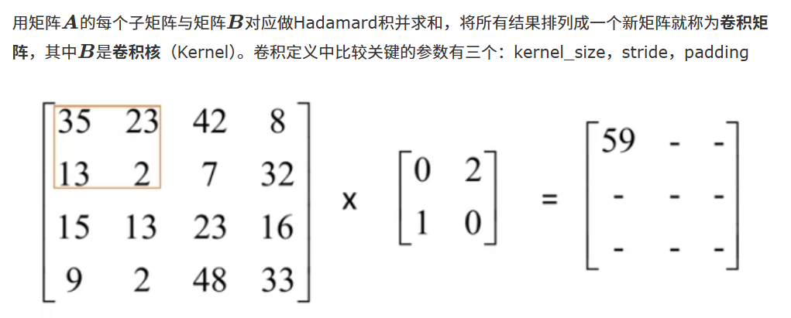

**矩阵乘法**

普通方法计算矩阵乘法时间复杂度为mnk

**卷积运算**

可以降低维度，降低复杂度

普通卷积计算的复杂度为nnkk

**行列式**

det为0的矩阵不存在：从几何层面来说意味着维度降低了

### **神经元**

**神经元**是模拟生物神经元的计算模型，它完成的是一次“线性变换 + 非线性激活”的过程。

- **输入 ( x )**：来自上一层的数据或原始特征。
- **权重 ( w )**：代表连接的强度，是模型需要学习的核心参数。
- **偏置 ( b )**：给线性方程增加一个偏移量，提高模型的灵活性（即使输入为 0，神经元也能输出非零值）。

### **加权和**

1.激活值与对应权重相乘得到一个加权和，激活值处于0与1之间（利用sigmoid函数实现）

2.加权和大于10时，激发在有意义，加上偏置值可以保证这个加权和不随便激发，

*对表达式结果向量中的每一项都取一次sigmoid*

3.从概念上讲，每一个神经元都与上一层所有神经元相连接，决定其激活值的加权和中的权重有点像是那些连接的强弱，而偏置值则表明神经元是否更容易被激活

4.将每个输出的激活值与想要的值之间的差的平方加起来，成为训练单个样本的“代价”（loss）

### **梯度**

1.函数的梯度：函数的最陡增长方向，即按梯度方向走，函数值增长得就最快，按梯度负方向走，函数值降低的最快，梯度向量的长度代表最陡的斜坡有多陡

2.按照负梯度的倍数，不停调整函数输入值的过程，叫做梯度下降法

**反向传播算法**

### **链式法则**

  ### **网络架构**

神经网络通常由三部分组成：

1. **输入层 (Input Layer)**：接收原始数据（如图像像素、文本向量）。
2. **隐藏层 (Hidden Layers)**：
   - 层数越多，网络越“深”（Deep）。
   - 每一层负责提取不同抽象程度的特征。
3. **输出层 (Output Layer)**：产生最终的预测结果。

### **前向传播**

1.信息是单向流动的，没有任何反馈

2.计算时运用矩阵乘法

### **过拟合**

把训练数据的偶然特征当成了判断标准

原因

- 模型太复杂
- 数据太少
- 训练过度