# 线性代数

## 01向量究竟是什么

1.向量的数乘（拉伸或压缩，有时与向量反向的过程）被称为“缩放”，与向量数乘的数为标量，自始至终，数字在线性代数中起到的主要作用就是缩放向量。

2.线性代数围绕两种基本运算：向量加法与向量数乘 

## 02线性组合、张成的空间与基

1.指向正右/左的单位向量（i/j）被称为i帽/j帽，i与j是xy坐标系的“基向量”

2.两个数乘向量的和被称为这两个向量的线性组合

3.所有可以表示为给行向量线性组合的向量的集合被称为给定向量张成的空间（span）

4.大部分二维向量的张成空间是整个无限大的二维平面，如果共线，他们张成的空间就是一条直线。

5.在三维空间中任取两个向量，这两个向量张成的空间就是它们所有可能的线性组合，也就是缩放再相加之后所有可能得到的向量。即为三维空间中一个经过原点的平面或者说是所有终点落在这个平面上的向量的集合。

6.有多个向量，并且可以移除其中一个而不减小张成的空间，这种情况称他们是线性相关的。反之，如果所有向量都给张成的空间增添了新的维度，它们就被称为是线性无关的。 

7.空间的一组基的严格定义：张成该空间的一个线性无关向量的集合

## 03矩阵与线性变换

1.线性变换的性质（保持网格线平行且等距分布）

- 直线在变换后仍保持为直线，不能有所弯曲
- 原点必须保持固定

2.用数值描述线性变换：只需要记录两个基向量变换后的位置

计算变换后的位置只需要将矩阵与这个向量相乘即可

3.第一列为i变化后的，第二列为j变化后的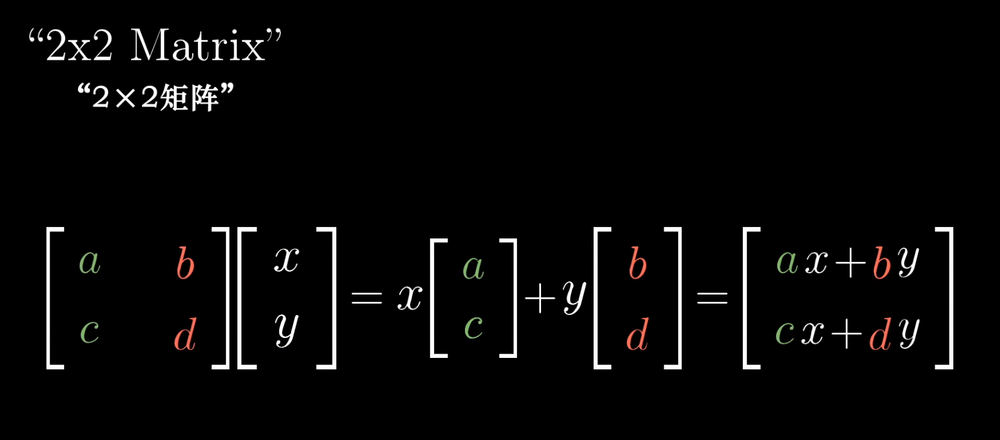

4.剪切：i保持不变，j移动到（1，1）

5.如果i与j变换后是（列）线性相关的，那么这个线性变换将整个二维空间挤压到它们所在的一条直线上

6.将线性变换看作空间的挤压伸展

## 04矩阵乘法与线性变换集合

1.

 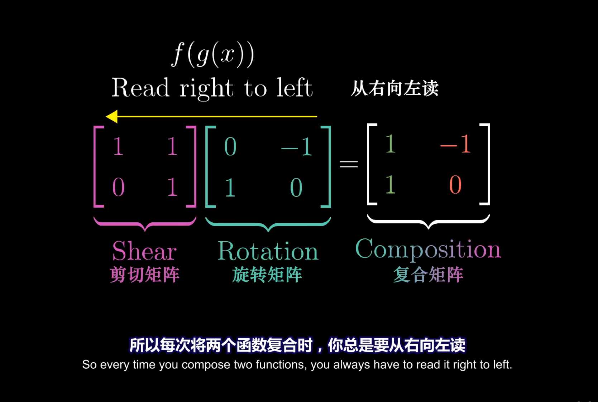

2.

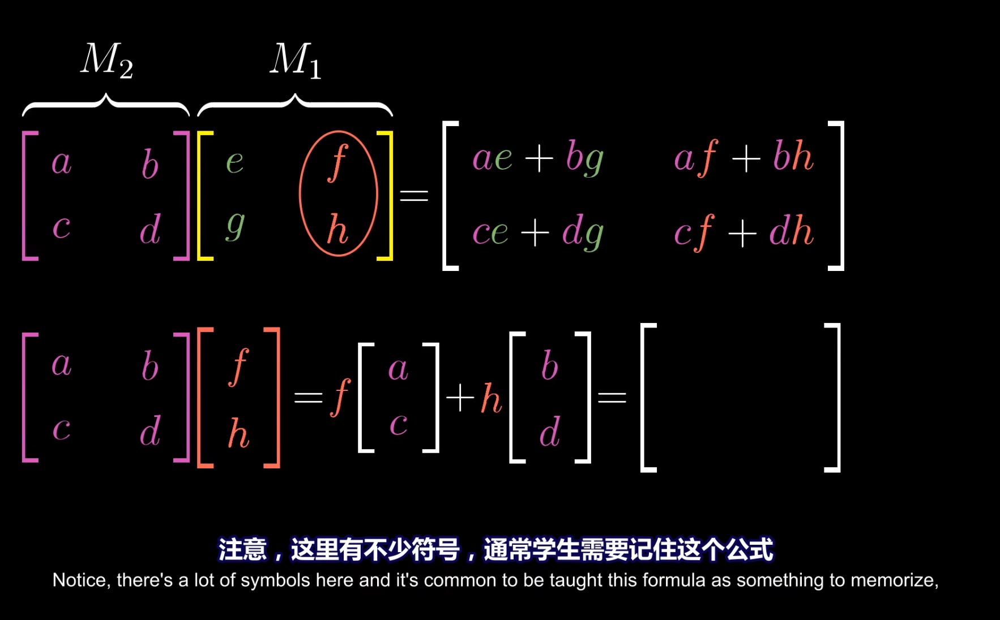

3.矩阵相乘的顺序会影响结果

4.矩阵乘法结合律

A(BC)=(AB)C

- 都是从右往左看，所以没有变化

## 05行列式

1.代表经过一个线性变换之后面积缩放的倍数

2.如果一个矩阵的行列式为0，那么说明变换后变成了一条直线，如果为负数，说明变换后改变了空间的定向（翻转的感觉）

3.推广到三维空间中，为体积缩放的倍数

## 06逆矩阵、列空间与零空间

1.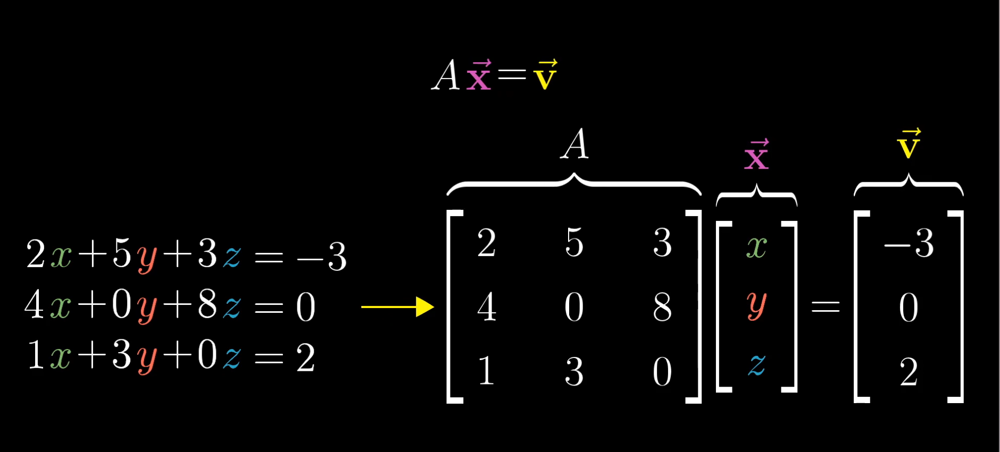

2.矩阵A代表一种线性变换，求解这个方程就是找到一个向量x，使得它在变换后与v重合

3.逆变换、恒等变换

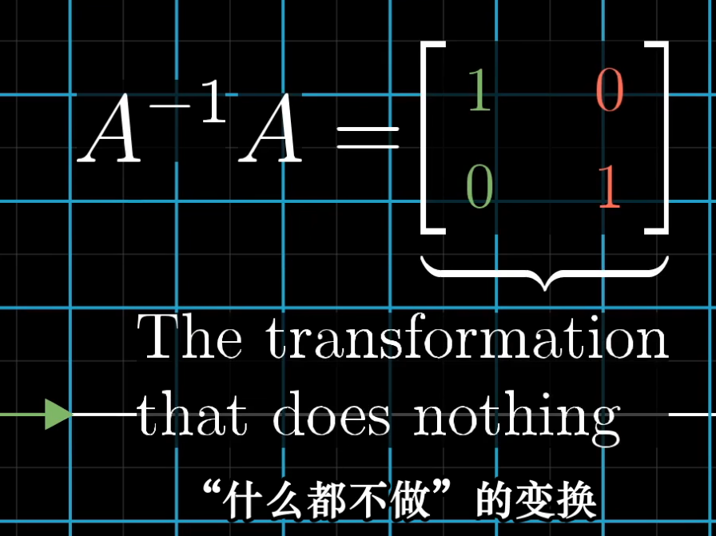

4.解1中的方程：在两边同时乘A的逆矩阵

5.在A的行列式为0时，如果v恰好在这条直线上，则有解，否则无解

6.当变换结果为一条直线时，也就是结果是一维的，我们称这个变换秩为1，如果是二维，那秩为2，所以，秩代表变换后空间的维数

7.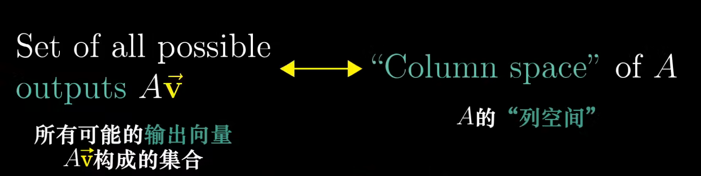

8.列空间就是矩阵的列所张成的空间，所以更精确的秩的定义是列空间的维数。当秩达到最大值时，意味着秩与列数相等，称为“满秩”

9.变换后落在原点的向量的集合，称为矩阵的零空间或核

10.一个3×2矩阵的几何意义是将二维空间映射到三维空间上，两列表示有两个基向量，三行表示变换后每一个基向量都要用三个独立的坐标来描述

## 07点积与对偶性

1.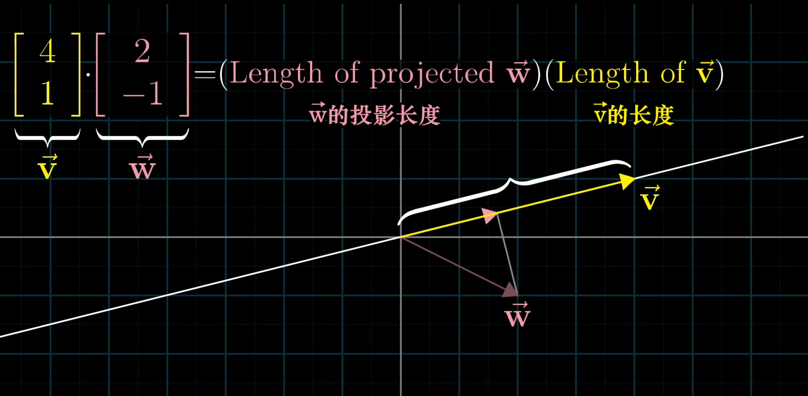

2.如果投影和V方向相反，点积应该为负

3.点积与顺序无关

4.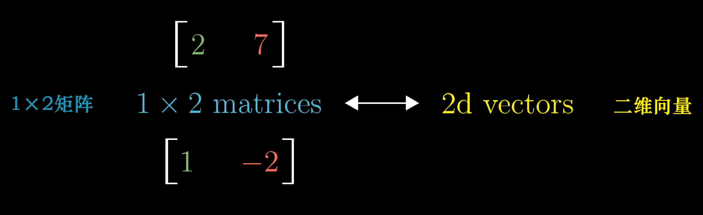

5.将向量放倒，从而得到与之相关的矩阵

6.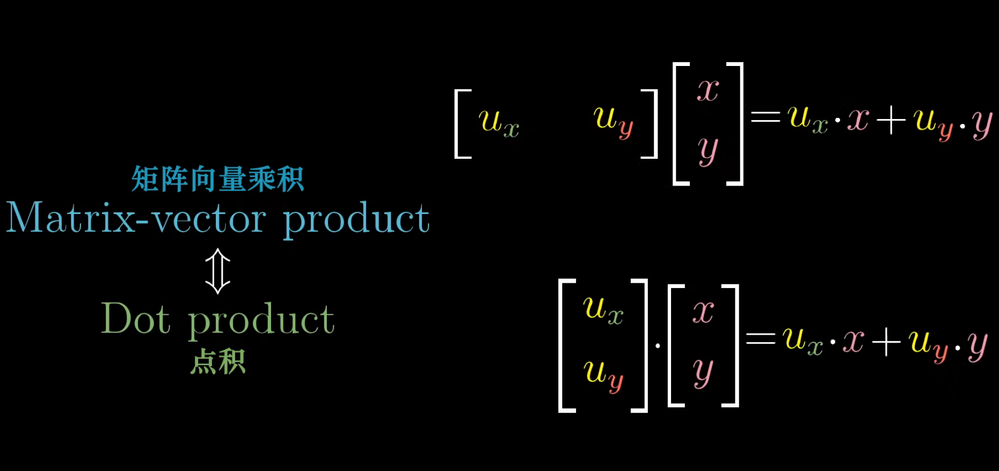

## 08叉积

1.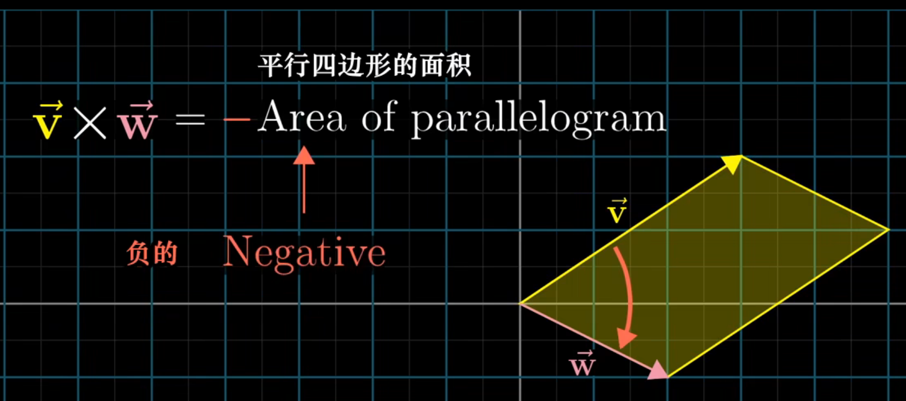

2.在右侧为正，左侧为负

3.求这个平行四边形的面积用行列式

4.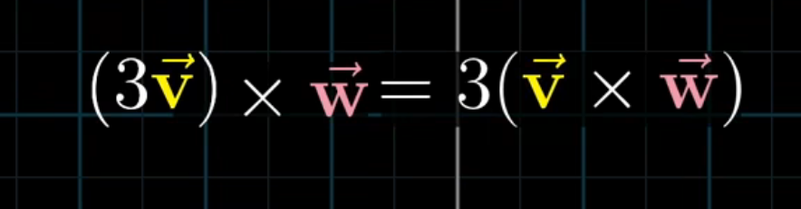

5.真正的叉积是通过两个三维向量生成一个新的三维向量

6.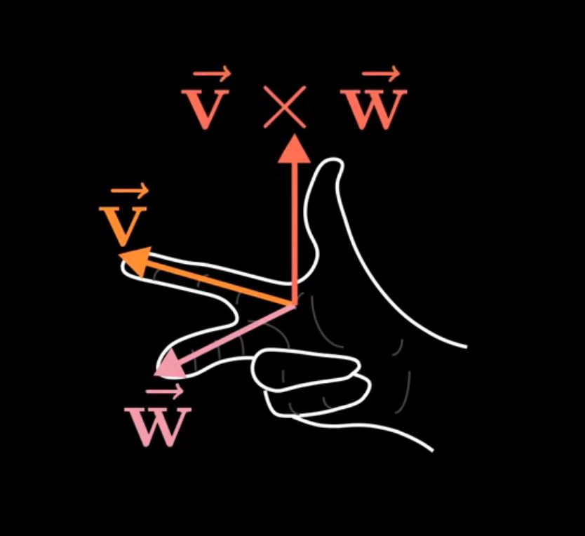

## 09基变换

1.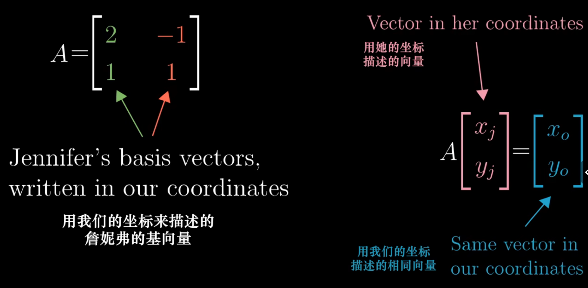

2.依次应用基变换，线性变换，基变换的逆，这三个矩阵符合给出的就是用詹妮弗语言描述的线性变换的矩阵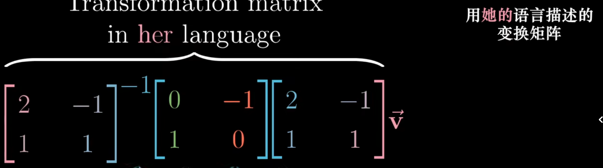

如果詹妮弗用这个矩阵与她坐标系中的一个向量相乘，结果就是在她的坐标系中描述的该向量旋转90°的结果

3.

中间的矩阵表示一种变换，而外侧两个矩阵代表着转移作用，也就是视角上的转化

## 10特征向量与特征值

1.特征向量：经过线性变换后仍留在自己的张成空间

2.每个特征向量都有一个所属的值，称为“特征值”

3.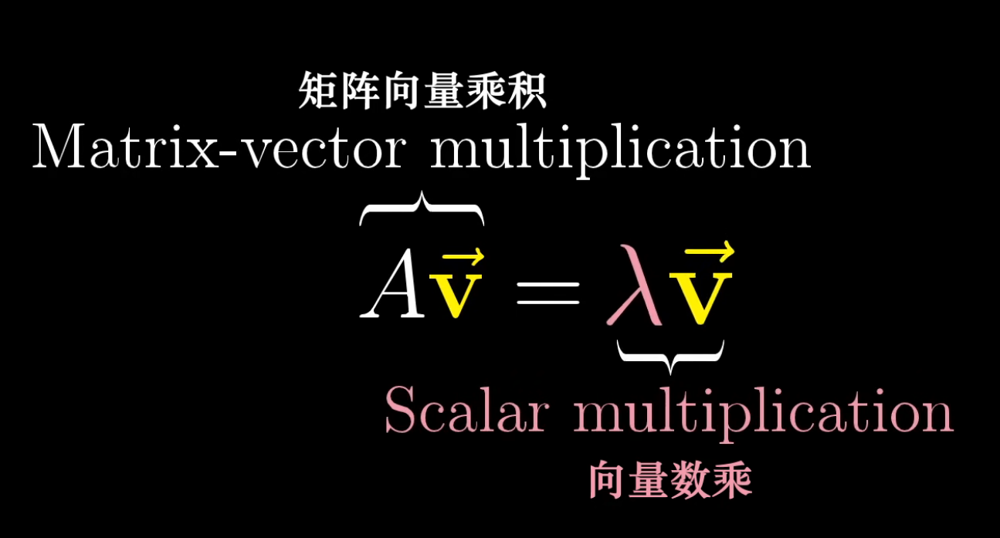

4.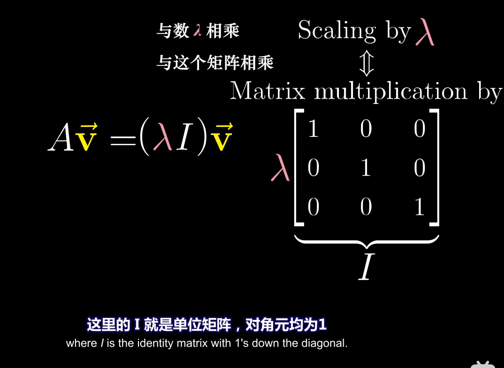当且仅当矩阵代表的变换将空间压缩到更低的维度时，才会存在一个非零向量，使得矩阵和它的乘积为零向量。而空间压缩对应的就是矩阵行列式为零

5.也就是说向量v是A的一个特征向量

6.二维线性变换不一定有特征向量

7.可能出现只有一个特征值，但是特征向量不止在一条直线上的情况（比如将所有向量变为两倍的矩阵

8.一组既是基向量也是特征向量构成的集合被称为一组特征基

 